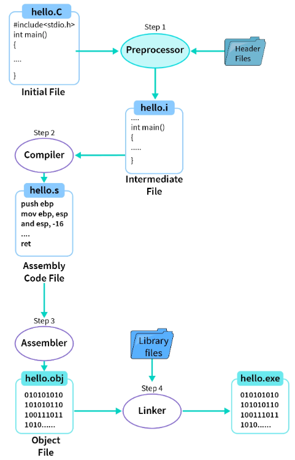
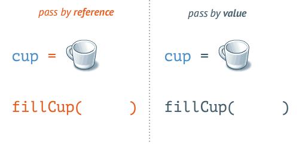
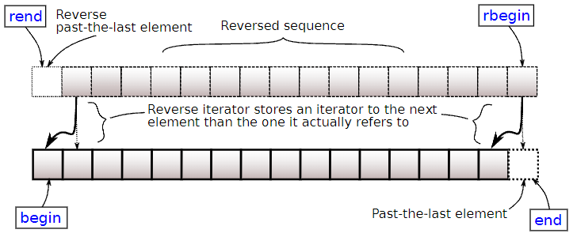
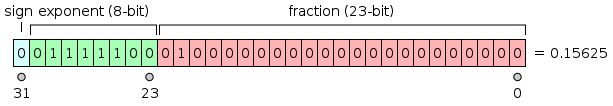
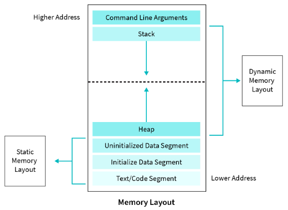
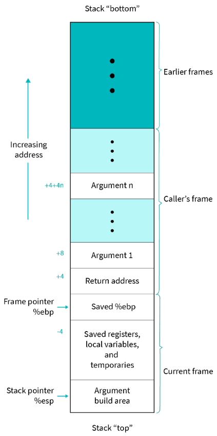

# C++
- [introduction](#introduction)
- [containers](#containers)
  - [sequence](#sequence)
  - [associative](#associative)
  - [unordered associative](#unordered-associative)
- [object oriented programming](#object-oriented-programming)
  - [move semantics](#move-semantics)
  - [inheritance](#inheritance)
  - [polymorphism](#polymorphism)
- [file \& string stream](#file--string-stream)
- [memory](#memory)
- [pointers](#pointers)
- [templates](#templates)
- [error handling](#error-handling)
- [misc](#misc)
  - [cpp core guidelines](#cpp-core-guidelines)
  - [standard template library](#standard-template-library)

## links  <!-- omit from toc -->
- [UBonn, 2018](https://www.youtube.com/playlist?list=PLgnQpQtFTOGR50iIOtO36nK6aNPtVq98C)

## todo  <!-- omit from toc -->
- [spiral rule](https://riptutorial.com/c/example/18833/using-the-right-left-or-spiral-rule-to-decipher-c-declaration)
- [cpp core guidelines](http://isocpp.github.io/CppCoreGuidelines/CppCoreGuidelines#main)
- [lost art of struct packing](http://www.catb.org/esr/structure-packing/)
- [memory order](https://en.cppreference.com/w/c/atomic/memory_order)
- [mix C & C++](https://isocpp.org/wiki/faq/mixing-c-and-cpp#:~:text=Just%20declare%20the%20C%20function,int)
- [add other containers](https://en.cppreference.com/w/cpp/container)
- STL

## introduction
- **standard I/O channels:** one input (`stdin` as `cin`) & two output (`stdout` as `cout` & `stderr` as `cerr`)
  ```cpp
  std::cout << "out log" << std::endl;
  fprintf(stderr, "error log");
  ```
- **preprocessor:** continuation (`\`), stringize (`#`), token pasting (`##`)
  ```cpp
  __DATE__  // May 16 2022
  __TIME__  // 09:42:38
  __FILE__  // D:\workspace\code\src\main.cpp
  __LINE__  // 23

  #pragma once  // include file only once

  #error message  // preproc error

  #define macroFunc(a, b) printf("val"#a " : %d, " "val"#b " : %d\n", \
                                  val##a, val##b)

  int main(void)
  {
      int val1 = 40;
      int val2 = 30;
      macroFunc(2, 1);  // val2 : 30, val1 : 40
      return 0;
  }
  ```
- **command line arguments:** `int main(int argc, char const *argv[])`
  ```sh
  ./exe_main command line arguments
  # argc == 4
  # argv[] == {"exe_main", "command", "line", "arguments"}
  ```
- **compiler:** preprocessor ⟶ compiler ⟶ assembler ⟶ linker  
  
  ```sh
  -std=c++11        # set C++ standard
  -Wall             # all warnings
  -Wextra           # extra warnings
  -Werror           # warnings as errors
  -O<n>             # speed optimization
  -Os               # size optimization
  -Og               # debug optimization
  -ftree-vectorize  # auto vectorization
  -g<n>             # keep debugging symbols
  -pg               # extra profile information for gprof
  -l                # library
  -L                # library search path
  -I                # include search path
  -D<flag>=<value>  # add preprocessor flag
  -fPIC             # position independent code (suitable for inclusion in shared libs), example: jumps relative instead of absolute
  -c                # compile but don't link
  -save-temps       # save intermediate source files
  ```
- **`auto`:** type deduced from initialization value
  ```cpp
  auto var = 13;     // int
  auto var = 13.0f;  // float
  auto var = 13.0;   // double
  ```
- **bitwise operators:**
  ```
  A     = 0011 1100
  B     = 0000 1101
  -----------------
  A&B   = 0000 1100     AND
  A|B   = 0011 1101     OR
  A^B   = 0011 0001     XOR  // (same bit == 0, else == 1)
  ~A    = 1100 0011     NOT
  A<<2  = 1111 0000     RSH
  A>>2  = 0000 1111     LSH
  ```
  - **example: XOR number swap:**
    ```cpp
    x = x ^ y;  // x == x ^ y
    y = x ^ y;  // y == (x ^ y) ^ y ⟶ (y ^ y) ^ x ⟶ 0 ^ x ⟶ x
    x = x ^ y;  // x == (x ^ y) ^ x ⟶ (x ^ x) ^ y ⟶ 0 ^ y ⟶ y
    ```
  - **example: bit manipulation:**
    ```cpp
    #define setBit(num, idx) (num |= (0x1 << idx))     // num |= 1 << idx;
    #define clearBit(num, idx) (num &= ~(0x1 << idx))  // num &= ~(1 << idx);
    #define flipBit(num, idx) (num ^= (0x1 << idx))    // num ^= 1 << idx;
    ```
- **ranged for loop:**
  ```cpp
  int a[] = {0, 1, 5};
  // for(const auto& value : container)
  for (auto n : a)
  {
      std::cout << n << " "; // 0 1 5
  }
  ```
- **infinite loop:**
  ```cpp
  for (;;)   // K&R style, no warning
  while (1)  // readable but compiler warning for condition always true
  ```
- ```cpp
  while (i = 0)   // set i, use i as condition (0 here)
  while (i == 0)  // use (i == 0) condition
  ```
- **`break`:** exit loop  
  **`continue`:** skip to next iteration
  ```cpp
  do
  {
      ...
      break;  // break without returning
      ...
  } while (0)
  ...
  return 0;
  ```
- **`goto`:**
  ```cpp
  int main()
  {
      goto second;
      printf("1\n");
  second:
      printf("2\n");  // only prints this

      return 0;
  }
  ```
- **function:**
  ```cpp
  // declaration: interface
  void printSum(int a, int b);
  // definition: implementation
  void printSum(int a, int b) { std::cout << a + b << std::endl; }
  ```
  - **overloading:** pick from all function with same name but different arguments (not return type), picked at compile-time
    ```cpp
    void printSum(int a, int b);
    void printSum(double a, double b);
    ```
  - **default arguments:** only in declaration, after mandatory arguments
    ```cpp
    int printSum(int a, int b, int c = 0, int d = 0);
    ```
- **argument passing:** use pass-by-reference (pointer or reference) to prevent copying of large objects, const reference to prevent copy & modification  
  

- **library:** logically connected multiple object files
  - **static:** linked into final executable, faster, takes lot of space, `*.a`
    ```sh
    ar rcs lib.a module1.o module2.o
    # rcs: replace, create, sort
    # c: create library
    # r: replace old files within library (if already exists)
    # s: create sorted index of library
    ```
  - **dynamic:** loaded every time executable is executed, slower, can be copied, `*.so`
    ```sh
    gcc -c -fPIC main.c -o main.o
    gcc -shared main.o -o libmain.so
    ```

## containers
- **iterator:** used to point at the memory addresses of containers, similar to pointer, allows quick navigation through containers
  ```cpp
  T::iterator
  *itr         // current element
  ++itr        // next element
  ```  
  

### sequence
- **sequence containers:** data structures that can be accessed sequentially
- **string:**
  ```cpp
  #include <string>
  std::string str;

  +                       // concatenate
  pos = str.find(substr)  // find substring pos
  str.empty()             // check empty
  str.size()              // size
  str.data()              // underlying C array
  str.c_str()             // NULL terminated string
  str[i]                  // access
  str.at(i)               // access with bounds checking
  str.front()             // first char, back()
  str.clear()             // clear string
  str.push_back(val)      // add val (as char) at end, pop_back()
  str.reserve(size)       // reserve size (prevent frequent mem alloc)
  str.shrink_to_fit()     // dealloc unused mem
  ```
- **array:** static contiguous array
  ```cpp
  #include <array>
  std::array<T, size> arr;

  arr.fill(value)  // assign value all elements
  // same as earlier: empty, size, data, c_str() [i], at(i), front, clear & iterators
  ```
- **vector:** dynamic contiguous array
  ```cpp
  #include <vector>
  std::vector<T> vec;

  // same as earlier: empty, size, data, c_str(), [i], at(i), front, clear, push_back, reserve, shrink_to_fit & iterators
  ```l
- **deque:** double-ended queue (2 sided vector, non contiguous mem)
  ```cpp
  #include <deque>
  std::deque<T> dq;

  dq.push_front(val)  // add val at beginning, popfront()
  // same as earlier: empty, size, [i], at(i), front, clear, push_back, shrink_to_fit & iterators
  ```

### associative
- **associative containers:** sorted data structures that can be quickly searched
- **pair:**
  ```cpp
  #include <utility>
  std::pair<T1, T2> pr;
  pr = std::make_pair(val1, val2)  // create pair
  pr.first                         // first element, second
  ```
- **map:** collection of key-value pairs, sorted by unique keys, anything with defined less-than operator (`<`) can be used as key
  ```cpp
  #include <map>
  std::map<keyT, valT> mp;
  mp[key] = val;                           // insert/assign
  <posItr, bool> = mp.insert({key, val});  // insert value if not exists
  posItr = mp.find(key);                   // find element, (posItr == mp.end()) if not present
  if (mp.count(key) > 0)                   // check if key present, 0/1 for map
  // empty, size, at(key), clear & iterators
  ```

### unordered associative
- **unordered associative containers:** unsorted hashed data structures that can be quickly searched
- **unordered map:** similar to map but unsorted, instead organized into buckets based on hash of its key
  ```cpp
  #include <unordered_map>
  std::unordered_map<keyT, valT> ump;
  // [key], at(key), insert, find, count, empty, size, clear & iterators
  ```

## object oriented programming
- **`namespace`:** helps avoid name conflicts & group project into logical modules
  ```cpp
  // use
  using std::cout;
  // instead of
  using namespace std;  // especially in headers
  ```
  - **nameless namespace:** local to translation unit, like static but can also take user defined types,
    ```cpp
    namespace
    {
    const int SIZE = 100;
    }
    ```
- **`class`:** to encapsulate data along with methods to process them, `this` is pointer to current object
  ```cpp
  class someClass
  {
  public:
      someClass() {}   // constructor, atleast one
      ~someClass() {}  // destructor, exactly one
      // if no constructor/destructor, default one generated
      someClass(int a, int b) : num_a_(a), num_b_(b) {}  // initializer list, can initialize const members
      bool operator<(const someClass& other) {}          // operator overload
      someFunc() const {}  // const correctness, should not change object, const reference object needs this
      someFunc() {}        // function overload (because const missing)
      static void someStaticFunc() {}  // static member function, call without object
      static int some_num;  // static member variable, common across all objects

  protected:

  private:  // default access specifier
      int num_a_ = 0;
      int num_b_ = 0;

      // friend, give another class/function access to private & protected
      friend class anotherClass;                // friend class
      friend int add(someClass, anotherClass);  // friend function
  };
  ```
  ```cpp
  someClass var_0;             // default constructor
  someClass var_1(10, 11);     // custom constructor
  someClass var_2{10, 11};     // custom constructor with argument type checking
  someClass var_3 = {10, 11};  // same as var_2
  ```
- **`static`:** must be defined in *.cpp file
  - **member variable:** exists once per class (not per object), value equal across all objects, example: reference counter
    ```cpp
    class countedClass
    {
        countedClass() { countedClass::count++; }
        ~countedClass() { countedClass::count--; }

        static int count;
    }
    ```
  - **member function:** doesn't need an object, only needs an object to access private members
    ```cpp
    // static member function call
    someClass::staticFunc(args);
    ```
- **`struct`:** `class` where everything is `public`
  - **braced initialization:** struct members should be uninitialized for this
    ```cpp
    struct someStruct
    {
        int a;
        string b;
    };

    void printStruct(someStruct& s)
    {
        cout << s.a << s.b << endl;
    }

    int main()
    {
        printStruct({10, "world"});  // braced initialization
        return 0;
    }
    ```
  - **struct padding:** align members to natural address boundaries  
    **struct packing:** prevent padding
  - **struct bitfields:** pointer not possible since size can be smaller than granularity allowed by pointers
    ```cpp
    typedef struct
    {
        uint8_t a : 4;
        uint8_t b : 4;
    } two_nibbles;

    two_nibbles temp;
    temp.a = 5;
    temp.b = 17;
    printf("%u %u %u\n", sizeof(temp), temp.a, temp.b);  // 1 5 1 (b overflowed)
    ```
- **resource acquisition is initialization (RAII):** resource allocation/acquisition/initialization is done by the constructor, while resource deallocation/release/deinitialization is done by the destructor
- **forward declaration:**
  ```cpp
  class someClass1;  // forward declaration
  class someClass2;  // forward declaration

  class someClass1
  {
      friend int sum(someClass1, someClass2);  //  error without forward declaration error (someClass2 undefined)
  };

  class someClass2
  {
      friend int sum(someClass1, someClass2);
  };
  ```

### move semantics
- **lvalue:** occupies memory  
  **rvalue:** everything else, defined using `&&`
- **`std::move`:** converts lvalue to rvalue, transfers ownership, dont access moved variable (undefined by cpp standard), performance better than copying but worse than passing by reference
    ```cpp
    int b = std::move(a)  // memory tranferred to b
    ```
- **copy/move constructor/assignment operator:** use move constructor/assignment operator to take ownership of another object
  ```cpp
  myClass(myClass &other) {}              // copy constructor
  myClass &operator=(myClass &other) {}   // copy assignment operator
  myClass(myClass &&other) {}             // move constructor
  myClass &operator=(myClass &&other) {}  // move assignment operator
  ```
- ```cpp
  myClass a;      // default constructor
  myClass b(a);   // copy constructor
  myClass c = a;  // copy constructor
  a = b;          // copy assign operator

  myClass b(std::move(a));   // move constructor
  myClass c = std::move(b);  // move constructor
  a = std::move(b);          // move assign operator
  ```
- **rule of all or nothing:** define all 6 special functions (destructor + constructor + above 4) or define none, if none defined `default` functions used  
if class has constant data member then above 4 functions are implicitly marked `delete` by compiler
  ```cpp
  myClass() = default;               // autogenerated functions, may use shallow copy
  myClass(myClass &other) = delete;  // compilation error if called
  ```
  - `delete` can be used to disallow certain functions as well (alternative to `{ }`)
    ```cpp
    class someClass
    {
    public:
        int someFunc(int num) {}
        int someFunc(double size) = delete;
    }
    ```

### inheritance
- **inheritance:** inherit public & protected data & functions from another class, seperate 6 special functions & private members  
three types: public (public & protected same as base), protected (both protected) & private (both private)
  ```cpp
  class rectangleClass
  {
  public:
      rectangleClass(int w, int h) : width_(w), height_(h) {}

  protected:
      int width_;
      int height_;
  };

  class squareClass : public rectangleClass  // default private
  {
  public:
      squareClass(size) : rectangleClass(size, size) {}
  };
  ```
- **composition:** combining simpler objects to make more complex ones
  - inheritance is `is a` relationship, example: square is a rectangle
  - composition is `has a` relationship, example: car has a wheel

### polymorphism
- **polymorphism:** ability to present same interface for differing underlying implementations, inherited classes may have different functionality but share a common interface
  - **compile-time:** function & operator overloading
  - **run-time:** function overriding, used for generic class references
    ```cpp
    derivedClass1 a;
    derivedClass2 b;
    baseClass& c = a;  // can be generic reference for derivedClass1 or derivedClass2
    ```
- **function overriding:** `virtual` function in base class can be overridden in derived class, same function prototype in both base & derived, need to check which function in virtual table needs to be called (costs extra time)
  ```cpp
  class baseClass
  {
  public:
      void print1()
      {
          std::cout << "print1 baseClass" << std::endl;
          this->print2();
      }

      virtual void print2() { std::cout << "print2 baseClass" << std::endl; }
  };

  class derivedClass : public baseClass
  {
  public:
      void print2() override { std::cout << "print2 derivedClass" << std::endl; }
      // c11:     void print2() override {}
      // older:   virtual void print2() {}
  };

  int main()
  {
      derivedClass b;
      b.print1();  // print1 baseClass
      b.print2();  // print2 derivedClass
                   // but without virtual: print2 baseClass
      return 0;
  }
  ```
- **pure virtual function:** no base implementation, used to force all derived classes to override the function
  ```cpp
  virtual myFunc() = 0;
  ```
- **abstract class:** class with atleast one pure virtual function, cannot create object
- **interface:** class with only pure virtual functions & no data members
- **example: strategy pattern:** encapsulate a family of algorithms into separate classes that implement a common interface  
  

## file & string stream
- **fstream:** read/write file
  ```cpp
  #include <fstream>
  std::fstream file(string& filename, Mode std::ios_base::mode);
  ```
  - **modes:**
    ```cpp
    in      // for reading
    out     // for writing
    binary  // in binary mode
    app     // append output
    ate     // seek to EOF when opened
    trunc   // overwrite existing file
    ```
- **`ifstream`:** `fstream` with default mode `in`  
  **`ofstream`:** `fstream` with default mode `out`
- ```cpp
  // read one line at a time
  while (getline(ifstream, string))
  {
      // process line
  }
  ```
- ```cpp
  // binary data
  std::ofstream output_file("output.bin", ios_base::out | ios_base::binary);
  output_file.write(reinterpret_cast<char*>(data), sizeof(data));
  ```
- **example: read regular columns:** that every line should have all columns
  ```cpp
  // 1 one   0.1
  // 2 two   0.2
  // 3 three 0.3

  int a;
  string b;
  float c;

  std::ifstream input_file("input_data.txt", ios_base::in);

  while (input_file >> a >> b >> c)  // read values
  {
      std::cout << a << b << c << std::endl;  // print values in same order
  }
  ```
- **sstream:** allows a string to be treated like a stream
  ```cpp
  #include <sstream>

  // create string
  std::stringstream out_sstream;
  out_sstream << "pi " << 3.14;
  std::string str_out = out_sstream.str();
  std::cout << str_out << std::endl;  // pi 3.14

  // reset sstream string
  out_sstream.str("");

  // parse string
  std::stringstream in_sstream(str_out);
  std::string str;
  float val;
  in_sstream >> str >> val;  // str: "pi", val: 3.14
  ```

## memory
- **type qualifiers:** C++ only has first two
  - **`const`:** read-only
  - **`volatile`:** value can be changed by something beyond the program, no caching, `const volatile` for read-only status register
  - **`restrict`:** optimization hint to compiler that during its lifetime no other pointer will be used to access the same memory
  - **`_Atomic`:** read-modify-write operators guaranteed in single instruction, free from data races
    ```cpp
    #include <iostream>
    #include <sstream>
    #ifdef __STDC_NO_ATOMICS__
        #error no atomics
    #endif

    _Atomic const int *p1;   // pointer to atomic const int
    const atomic_int *p2;    // same
    const _Atomic(int) *p3;  // same
    ```
- **storage class specifier:**
  - **`auto`:** default
  - **`register`:** hint to compiler to place it in processor's register
  - **`static`:** local static variable keeps its value between invocations, global static variable/function local to translation unit
  - **`extern`:** used for external linkages, only mention specifier for declarations & keep them in header, cross checking between translation units
    ```cpp
    // header.h
    extern int g_val;
    extern int increment(void);

    // source1.c
    #include "header.h"
    int g_val = 77;
    int incrememt(void) { return (++g_val); }

    // source2.c
    #include "header.h"
    printf("%d\n", g_val);        // 77
    printf("%d\n", increment());  // 78
    ```
  - **`mutable`:** C++ only, to allow a particular data member of const object to be modified, example: mutexes
- **1s complement:** invert all bits  
  **2s complement:** add 1 to 1s complement
- **integer representation:** negative numbers stored as 2s complement
  - **signed:** `-2^(n-1)` to `2^(n-1) - 1`  
    both `128` & `-128` have same 8-bit 2s complement (`10000000`), `-128` assumed since all bit-patterns with MSB set are negative
  - **unsigned:** `0` to `2^(n) - 1`
    ```cpp
    00011001  //  25
    11100110  //     (1s complement)
    11100111  // -25 (2s complement)
    ```
- **integer promotion:** `signed` promoted to `unsigned` when mixed
  ```cpp
  unsigned int a = 6;
  int b = -20;
  (a + b > 6) ? printf(">6") : printf("<=6");  // >6
  ```
- **sign extension:** preserving sign while increasing number of bits of a binary number
  ```cpp
  1001 0110            //  8 bit (-106)
  1111 1111 1001 0110  // 16 bit (-106)
  ```
- **float representation (IEEE 754):** single precision `1 + 8 + 23`, double precision `1 + 1 + 53`, half precision `1 + 5 + 10`  
  ```cpp
  263.3                            // floating number
  100000111.0100110011...          // binary
  1.000001110100110011... x 2^8    // scientific notation, true_exponent = 8
                                   // 1 is invisible leading bit
  sign = 0
  exp = 8 + 127 = 10000111         // exponent = true_exponent + bias
                                   // bias = 2^(exp_bits-1)-1
  mant = 00000111010011001100110   // bits after leading bit

  0 10000111 00000111010011001100110
  ```  
  
- **endianness:** order in which a sequence of bytes is stored in computer memory
  ```cpp
  value:          0x12345678
  big endian:     12, 34, 56, 78  // most significant byte at smallest memory address
  little endian:  78, 56, 34, 12  // least significant byte at smallest memory address
  ```
- **example: endianness conversion:**
  ```cpp
  uint32_t num = 9;
  uint32_t b0, b1, b2, b3;
  uint32_t res;

  b0 = (num & 0x000000ff) << 24u;
  b1 = (num & 0x0000ff00) << 8u;
  b2 = (num & 0x00ff0000) >> 8u;
  b3 = (num & 0xff000000) >> 24u;

  res = b0 | b1 | b2 | b3;
  ```
- **memory layout:** each of the six different segments stores different parts of code and have their own read & write permissions  
**segmentation fault:** error from a program trying to access the value stored in any segment differently than it is supposed to  
    
  - **text:** read only instructions, `.rodata` read only const global data
  - **data:** initialized `global` & `static` variables (but `static` function in text)
  - **bss (b​lock started by symbol):** uninitialized, only size mentioned in executable, allocated after program load, initialized with 0 after allocation
  - **heap:** dynamic allocated during runtime, `std::bad_alloc` error if out of heap
    ```cpp
    float* f_ptr = new float[num];  // allocate array
    delete[] f_ptr;                 // delete array
    ```
    - **memory leak:** heap not dealloced or address lost (pointer reassigned)
    - **dangling pointer:** pointing to dealloced memory
    - **wild pointer:** pointing to random address
  - **stack:** simple last-in-first-out (LIFO) structure, stores local variables, function params & inheritance virtual function table
    - **stack pointer:** keeps track of top of the stacj
    - **stack overflow:** program attempts to use more memory than is available on stack, usually due to deep/infinite recursion leading to stack shortage
    - **stack frame:** function data (return addr, args, local vars) pushed onto stack, on ARM first 4 args stored `r0` to `r3`  
    `ebp` (frame pointer) is used to backup `esp` (stack pointer), while `esp` is being modified by the current function  
    
- **fragmentation:**
  - **internal:** total memory space is enough but it is allocated in large number of non-contiguous blocks leaving large part of total memory unallocated but unusable
  - **external:** memory page assigned to a process is larger than what is being allocated & unused part cannot be used by another process
- **shallow copying:** just copy pointers, not data (default copy constructor/assignment op), can lead to dangling pointer when object shallow copied  
  **deep copying:** copy data, create new pointers

## pointers
- **pointer vs reference:** own memory vs alias, no init required vs init in declaration, can reassign vs cannot, can be NULL vs cannot, indirection (levels of pointers) vs single level, can apply arithematic operations vs cannot, can store in vector/array vs cannot
- **`->` operator:** `obj->myFunc()` is same as `(*obj).myFunc()`
- **pointer polymorphism:** used for strategy pattern, initialize to NULL & check interface pointer before calling its methods
  ```cpp
  derivedClass a;
  baseClass *b = &a;
  ```
- **const pointers:**
  ```cpp
  // read right to left
  const int *       // pointer to const int
  int *const        // const pointer to int
  const int *const  // const pointer to const int
  ```
- **smart pointer:** wrapper class over a raw pointer that owns heaps memory & manages its lifetime, when the object is destroyed it frees the memory as well
  ```cpp
  #include <memory>
  sPtr.get();  // get raw pointer
  ```
  - **unique:** can be moved but cannot be copied, memory always owned by single unique pointer
    ```cpp
    auto uPtr = std::unique_ptr<myType>(new myType);        // default constructor
    auto uPtr = std::unique_ptr<myType>(new myType(args));  // custom constructor
    auto uPtr = std::make_unique<myType>(args);             // C++14
    ```
  - **shared:** `std::shared_ptr`, can be copied, `usage_count` incremented/decremented when copied/destructed, mem freed when `usage_count == 0`
    ```cpp
    auto sPtr = std::shared_ptr<myType>(new myType);        // default constructor
    auto sPtr = std::shared_ptr<myType>(new myType(args));  // custom constructor
    auto sPtr = std::make_shared<myType>(args);             // C++11
    sPtr.use_count();                                       // return usage_count
    sPtr.reset(ptr);                                        // decrease usage_count
    ```
    ```cpp
    class A
    {
    public:
        A(int a) { std ::cout << "alive" << std::endl; }
        ~A() { std ::cout << "dead" << std::endl; }
    };

    int main()
    {
        // equivalent to std::shared_ptr<A>(new A(10));
        auto a_ptr = std ::make_shared<A>(10);              // alive
        std ::cout << a_ptr.use_count() << std ::endl;      // 1
        {
            auto b_ptr = a_ptr;                             // alive
            std ::cout << a_ptr.use_count() << std ::endl;  // 2
        }
        std ::cout << "main scope\n";
        std ::cout << a_ptr.use_count() << std ::endl;      // 1

        return 0;                                           // dead
    }
    ```
- **example: smart pointer with local variable:** both stack & smart pointer will try to dealloc that memory leading to error
  ```cpp
      int a = 0;
      auto a_ptr = std ::unique_ptr<int>(&a);
      return 0;  // *** Error in `file ': free (): invalid pointer: 0 x00007fff30a9a7bc ***
  ```
- **example: smart pointer polymorphism:** good way of using smart pointer
  ```cpp
  std::vector<unique_ptr<baseClass>> vec;

  // first method, "new derivedClass" passed to constructor of unique_ptr
  vec.push_back(new derivedClass);

  // second method, need to move (default is copy)
  auto var = unique_ptr<derivedClass>(new derivedClass);
  vec.push_back(std::move(var));

  return 0;  // both dealloced
  ```
- **type casting:** converting expression of given type into another type
  - **implicit:** change types without changing the value, happens automatically, lower data type converted to higher type
    ```cpp
    short a = 1024;
    int b = 5;
    b = a;  // implicit conversion
    ```
  - **explicit:** force type conversion, two types
    ```cpp
    float a = 1.2;
    int b = (int)a + 1;  // C-like notation explicit coversion
    int c = int(a) + 1;  // functional C-like explicit coversion
    ```
    ```cpp
    unsigned char u = (unsigned char)(-9);  // same bit pattern (2s complement), 247
    ```
  - **type casting operators:**
    ```cpp
      // newType new_var = static_cast<newType>(var);
      static_cast       // compile-time implicit convertion
      const_cast        // remove const from const ref of non-const variable
      reinterpret_cast  // reinterpret bytes of one type as another type
      dynamic_cast      // runtime convertion of derivedClass pointer to baseClass pointer, nullptr if failed
      ```
- **function pointer:**
  ```cpp
  int foo(int);     // function
  int *foo(int);    // function returning int*
  int (*foo)(int);  // function pointer, by changing precedence using ()
  ```
  ```cpp
  int foo(int arg)
  {
      printf("foo %d\n", arg);

      return arg;
  }

  int main()
  {
      int (*func_ptr)(int);
      func_ptr = &foo;
      int ret = (*func_ptr)(10);  // foo 10

      // OR
      func_ptr = foo;
      int ret = func_ptr(10);    // foo 10

      printf("ret %d\n", ret);   // ret 10

      return 0;
  }
  ```
- **spiral rule:**
  ```cpp
  int a;              // int
  int *a;             // pointer to int
  int **a;            // pointer to pointer to int
  int a[10];          // array of 10 ints
  int *a[10];         // array of 10 pointers to ints
  int (*a)[10];       // pointer to array of 10 ints
  int (*a)(int);      // pointer to function a that takes int argument & returns int
  int (*a[10])(int);  // array of 10 pointers to functions that take int argument & return int
  ```

## templates
- **generic programming:** seperate algorithms from data type
- **templates:** compile-time type-independent/generic algorithms, `<T>` macro expanded, no definition till expansion (linker error)
  - **template function:** can use any type that is copy constructable, assignable & defined by the time template compiled (custom classes)
    ```cpp
    template <typename T>  // can use typename or class keyword
    T func1(const T &arg1)
    {
    }

    func(10);     // type infered by compiler
    func<int>();  // explicit type (in case data type cannot be determined by compiler)
    ```
  - **template class:** used for meta programming (programs that modify programs), compiler generates objects based on types we passed
    ```cpp
    template <typename T>
    class myClass
    {
    public:
        myClass(const T &var) : var_(var){};

    private:
        T var_;
    }

    myClass<int> my_object(10);
    ```
- **specialization:** different template function/class implementation for a specific type
  ```cpp
  template <typename T>  // generic
  T func()
  {
  }

  template <>  // specialized
  int func()
  {
  }

  func<int>();     // specialized
  func<double>();  // generic
  ```
- **template classes headers/source:** always declare & define in same `*.h` file, concrete template classes are generated at compile time, linker does not know about the implementation
  - workaround: not scalable but declare in `*.h` file, implement in `*.cpp` but at the end create objects for types you expect to use

## error handling
- **exception:** thrown when there is an error, constructor of exception received a string error message, `what()` to get exception string
  - `logic_error`
  - `invalid_argument`
  - `domain_error`: not defined for certain domain
  - `length_error`: exceeds max size
  - `out_of_range`: access out of bounds
  - `runtime_error`
  - `range_error`: requested operation doesn't make mathematical sense in the domain considered, *e.g.* `srqt(negative_number)` in real domain
  - `overflow_error`/`underflow_error`: result exceeds capacity of underlying type
- **`try`** ⟶ **`throw`** ⟶ **`catch`**
  ```cpp
  #include <stdexcept>

  void someFunc(void)
  {
      if (badEvent)
      {
          string msg = "error string";
          throw runtime_error(msg);
      }
  }

  try
  {
      x = someFunc(a, b, c);  // throws exception
  }
  catch (runtime_error &exp)
  {
      cerr << "runtime error: " << exp.what() << endl;
  }
  catch (logic_error &exp)
  {
      cerr << "logic error: " << exp.what() << endl;
  }
  catch (exception &exp)  // generic
  {
      cerr << "some exception: " << exp.what() << endl;
  }
  catch (...)  // catch everything
  {
      cerr << "unknown exception" << endl;
  }
  ```

## misc
- **`using`:** create type aliases, `using newType = oldType;`, similar to `typedef`, creates local alias if used within function scope
  ```cpp
  using image3f = image<float, 3>;
  using vector3d = double[3];  // not possible using `typedef`
  ```
- **why typedef over macro:**
  ```cpp
  #define type1 struct s *
  typedef struct s *type2;

  type1 a, b;  // "a" pointer-to struct but "b" just struct
  type2 c, d;  // both "c" & "d" pointer
  ```
- **name mangling:** encoding of function/variable names so linker can seperate common names (overloading, namespaces)  
to link C code use
  ```cpp
  extern "C"
  {
      ....
  }
  ```
- **maximum munch rule:** compiler bites off biggest legal chunk
  ```cpp
  c = a+++b;  // a++ + b
  ```
- **format specifiers:**
  ```cpp
  %c  // char
  %s  // string
  %i  // int
  %u  // uint
  %o  // unsigned octal
  %x  // unsigned hex
  %e  // exponent notation
  %f  // float
  %g  // selects shorter of %f & %e, no trailing 0s
  %p  // pointer
  ```
- **data type constants**
  ```cpp
  0x  // hex
  0   // oct
  U   // uint
  L   // long int, UL
  LL  // long long int, ULL
  F   // float
  ```
- **enum:** assign names to integral constants, by default starts with 0
  - **unscoped:** can implicitly convert
  - **scoped:** implicit convertion leads to error, use `static_cast` if required
    ```cpp
    enum uFoo  // unscoped
    {
        a,
        b,
        c = 1,
        d = b + c
    };

    enum class sFoo  // scoped
    {
        a,
        b,
        c = 1,
        d = b + c
    };

    int enumValue = uFoo::a;  // implicit convertion
    int enumValue = sFoo::a;  // error
    ```
- **union:** different variables of different types in same memory location
  ```cpp
  union unn
  {
      int i;
      char c;
  };
  ```
- **typedef struct:**
  ```cpp
  typedef struct S_
  {
      int x;
  } S;

  // same as
  struct S_
  {
      int x;
  };
  typedef struct S_ S;
  ```
- **nested struct/union:**
  ```cpp
  typedef struct image
  {
      struct coordinate
      {
          int x;
          int y;
      };
      struct coordinate pos;
  } image;
  ```
- **lambdas:** function declared without name
  ```cpp
  auto plus_one = [](const int value) { return value + 1; };
  ```
- **functor** class that acts like a function, done by overloading `operator ()`
  ```cpp
  struct plusOne
  {
      int operator()(const int value) const { return value + 1; }
  };

  int main()
  {
      plusOne plus_one;
      assert(plus_one(2) == 3);

      return 0;
  }
  ```

### cpp core guidelines
- **basics:**
  ```cpp
  int some_random_var;  // snake case
  int some-random-var;  // kebab case
  int someRandomVar;    // camel case
  int SomeRandomVar;    // pascal case
  ```
- **naming:**
  ```cpp
  // snake_case: variables
  int some_var;
  // CAPITALIZED_SNAKE_CASE: constants & macros
  const int SOME_CONSTANT_VAR = 10;
  // camelCase: functions & classes
  int someFunction(void);
  ```

### standard template library
- STL
  ```cpp
  #include <algorithm>
  flag = std::all_of(startItr, endItr, boolFunc);      // all_of, any_of, none_of
  std::for_each(startItr, endItr, func);               // for_each
  itr = std::find(startItr, endItr, val_or_boolFunc);  // find
  std::fill(startItr, endItr, value);                  // fill
  std::generate(startItr, endItr, func);               // generate
  std::replace(startItr, endItr, old_val, new_val);    // replace
  std::rotate(startItr, new_startItr, endItr);         // rotate
  std::sort(startItr, endItr, operator);               // default std::less<T>, greater<>
  std::reverse(startItr, endItr);                      // reverse
  float sum = std::accumulate(startItr, endItr, initValue, operation); // default: std::plus<T>, (minus, multiplies, divides, modulus)

  #include <stdio.h>
  FILE *fp;
  fp = fopen("filename", "mode");  // r, rb, w, wb, a, ab
  fprintf(fp, char *....);
  fwrite(ptr, size, num_mem, fp);  // fread
  fclose(fp);
  getchar();

  #include <stdlib.h>
  ptr = malloc(size);  // malloc(0) valid pointer, implementation defined
  ptr = calloc(num_mem, size);
  ptr = realloc(ptr, newSize);
  free(ptr);
  abs(val);
  atoi(str);           // string to int
  assert(expr);        // assert if expr false

  #include <string.h>
  size = strlen(string);  // size excluding NULL (\0)
  memcpy(dst, src, size);
  memset(ptr, val, size);

  #include <math.h>
  ceil(num);
  floor(num);
  fabs(num);
  pow(num, power);
  sqrt(num);

  #include <unistd.h>
  sleep(numSeconds);  // usleep(numUSeconds)

  #include <time.h>
  clock_t t;
  t = clock();
  ...
  t = clock() - t;
  double time_taken = ((double)t) / CLOCKS_PER_SEC;
  ```