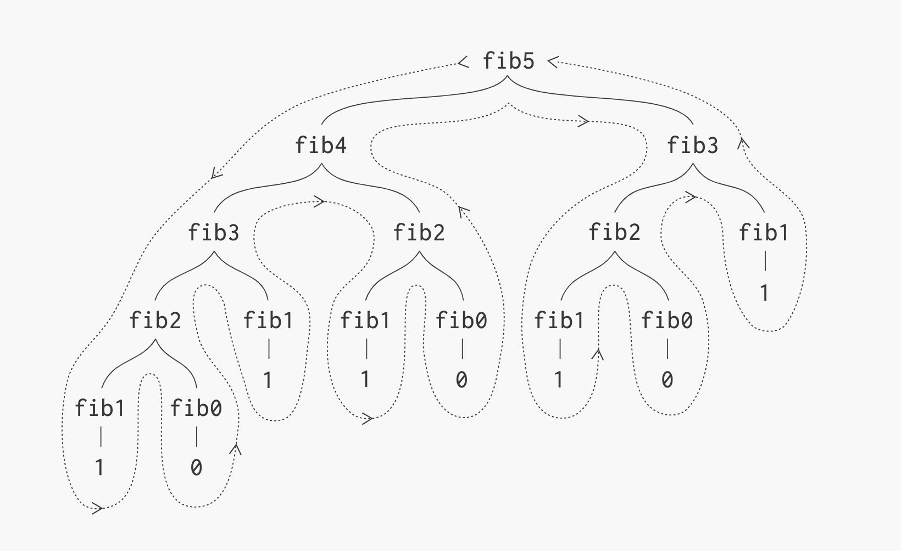

- [structure \& interpretation of computer programs](#structure--interpretation-of-computer-programs)
  - [introduction](#introduction)
  - [procedures \& process](#procedures--process)

# structure & interpretation of computer programs

## links  <!-- omit from toc -->
- [MIT 1986](https://www.youtube.com/playlist?list=PLE18841CABEA24090)
- [scheme (lisp dialect) interpreter](https://inst.eecs.berkeley.edu/~cs61a/fa14/assets/interpreter/scheme.html)

## todo  <!-- omit from toc -->
- [iterative process for fibonacci & towers of hanoi](https://en.wikipedia.org/wiki/Tower_of_Hanoi#Iterative_solution)

## introduction
- > The key to understanding complicated things is to know what not to look at and what not to compute and what not to think
- **declarative:** "what is true" knowledge, example: `y` is `sqrt(x)` if `y^2 = x`  
**imperative:** "how to" knowledge, example: square-root by successive averaging of guess `g` & `x/g` until result doesn't change much
- **techniques for controlling complexity:** make building very large programs possible
  - **black-box abstraction:** putting something in a box to supress details to go ahead & build bigger boxes OR your "how-to" method is an instance of a more general thing, example: fixed point of a function (`f(y) = y`) by succesive applying `f(g)` until result doesn't change much can be used for square-root if `f(g)` is average of `g` & `x/g`
  - **conventional interfaces:** agreed upon ways of plugging things together, example: use `(* x (+ a b))` to add numbers, vectors, polynomial, analog signals etc
  - **metalinguistic abstraction:** pick a new design language to highlight different aspect of the system (supress some kind of details & emphasize others)
- **lisp basics:** for learning any language we need to know three things: primitive elements, means of combination & means of abstraction  
prefix notation `(+ x y)` used uniformly since it is more generic & can take multiple arguments
  ```lisp
  ; primitive elements
  5                            ; 5
  3.14                         ; 3.14
  +                            ; PrimitiveProcedure (functions)

  ; means of combination
  ; composition
  (+ 5 3.14 1)                 ; 9.14
  (+ 4 (* 3 6) 8 2)            ; 32
  ; case analysis
  (define (abs x)              ; (using cond)
    (cond ((< x 0) (- x)))
          ((= x 0) 0)
          ((> x 0) x))
  (define (abs x)              ; (using if for single case)
    (if (< x 0)
        (- x)
        x))

  ; means of abstraction
  (define pi 3.14)             ; pi (define variable)
  (* pi pi)                    ; 9.869604403666765
  (define (square x) (* x x))  ; square (define procedure)
  (square (+ 1 4))             ; 25
  square                       ; (lambda (x) (* x x)) (above define is syntactic sugar for this)
                               ; lambda (x) is to construct a procedure with argument x
  ```

## procedures & process
- **procedure:** is the description/recipe of the process  
**process:** is the result of applying a procedure to arguments  
example: procedure is the blueprint, while process is the actual building construction
- computer science deals with idealised components unlike physical system where one has to worry about constraints of tolerance, approximation & noise  
so for building a large program there isn't much difference between what I can imagine & what I can build
- **formal parameter:** parameter written in function definition  
**actual parameter:** parameter written in function call
- **recursive definitions:** allows you to do infinite computations that go on until something is true
- **example: square root by sucessive averaging:**
  ```lisp
  ; block structure: package internals inside of definition
  (define (sqrt x)
    (define (try g x)                       ; try
      (if (goodenough? g x)
          g
          (try (improve g x) x)))
    (define (improve guess x)               ; improve
      (average guess (/ x guess)))
    (define (goodenough? g x)               ; goodenough?
      (< (abs (- (square x) x))
         0.001))
    (define (square x) (* x x))             ; square
    (define (average x y) (* (+ x y) 0.5))  ; average
    (try 1 x))                              ; sqrt
  (sqrt 2)                                  ; 1.41421568
  ```
- **substitution model:** when we evaluate a name we substitute its definition in place of the name & then evaluate the resulting definition
  - combinations:
    ```lisp
    (define (sos x y) (+ (sq x) (sq y)))  ; sum of squares
    (define (sq a) (* a a))
    (sos 3 4)                             ; 25

    ; substitution model
    (sos 3 4)
    (+ (sq 3) (sq 4))
    (+ (sq 3) (* 4 4))
    (+ (sq 3) 16)
    (+ (* 3 3) 16)
    (+ 9 16)
    25
    ```
  - special forms
    - conditionals: evaluate predicate first then the consequent/alternative expression
      ```lisp
      (if <predicate>
          <consequent>
          <alternative>)
      ```
      ```lisp
      (define (+ x y)
        (if (= x 0)
            y
            (+ (-1+ x) (1+ y))))         ; -1+ is decrement operator & 1+ is the increment operator
                                         ; counting down "x" till "y" is the sum
      (+ 3 4)                            ; 7

      ; substitution model
      (+ 3 4)
      (if (= 3 0) 4 (+ (-1+ 3) (1+ 4)))
      (+ (-1+ 3) (1+ 4))
      (+ (-1+ 3) 5)
      (+ 2 5)                            ; recursion
      (if (= 2 0) 5 (+ (-1+ 2) (1+ 5)))
      (+ (-1+ 2) (1+ 5))
      (+ (-1+ 2) 6)
      (+ 1 6)                            ; recursion
      (if (= 1 0) 6 (+ (-1+ 1) (1+ 6)))
      (+ (-1+ 1) (1+ 6))
      (+ (-1+ 1) 7)
      (+ 0 7)                            ; recursion
      (if (= 0 0) 7 (+ (-1+ 0) (1+ 7)))
      7
      ```
    - lambda expressions, definitions
- **peano arithmetic:** formalizes arithematic operations on natural numbers & their properties  
there are two ways to add whole numbers, both are recursive definitions but lead to different process types: iteration & recursion  
number of steps is approximation for time it takes to execute & width is the the space that needs to be remembered
  - **iteration:** time `O(x)` (steps increase as `x` increases) & space `O(1)` (same width for any `x`)  
  has all of its state in explicit variables (formal parameters), example: can continue the computation from `(+ 1 6)`  
    ```lisp
    (define (+ x y)
      (if (= x 0)
          y
          (+ (-1+ x) (1+ y))))

    (+ 3 4)
    (+ 2 5)
    (+ 1 6)
    (+ 0 7)
    7
    ```
  - **recursion:** time `O(x)` (steps increase as `x` increases) & space `O(x)` (deferred increments increase as `x` increases)  
  has its state not just in explicit variables but some information belongs to computer as well, example: cannot continue the computation from `(+ 1 4)` without knowing about deferred increments
    ```lisp
    (define (+ x y)
      (if (= x 0)
          y
          (1+ (+ (-1+ x) y))))

    (+ 3 4)
    (1+ (+ 2 4))
    (1+ (1+ (+ 1 4)))
    (1+ (1+ (1+ (+ 0 4))))
    (1+ (1+ (1+ 4)))
    (1+ (1+ 5))
    (1+ 6)
    7
    ```
  - typically, an iterative process passes the answer around as a parameter (the accumulator) in such a way that the last recursive call has no pending operations left  
  
- **perturbation analysis:** making small changes to the program & see how it affects the process
- **example: fibonacci numbers:** time is denoted by each node that the dotted arrow follows `O(fib(x))` & to go back from the tail node  to head node we have to remember all the intermediate nodes so space complexity is the longest path `O(n)`  
this program consists of just two rules: break up something into two parts for `(> n 2)` & reduction for `(< n 2)`
  ```lisp
  ; [0] 1 1 2 3 5 8 13 21 34 . . .
  (define (fib n)
    if(< n 2)
      n
      (+ (fib (- n 1)) (fib (- n 2))))
  ```  
  
- **example: towers of hanoi:** move `n` disks from tower 'from' to tower `to` using an extra tower `spare`  
suppose we know how to move `n-1` disks, then we move `n-1` disks to `spare`, `n`th disk to `to`, then `n-1` disks on top of `n`th in `to`  
this is possible through recursion because we always count down here & 0 high tower requires no moves
  ```lisp
  (define (move n from to spare)
    (cond ((= n 0) "done")
          (else
            (move (-1+ n) from spare to)     ; move "n-1" disks "from" to "spare" using "to" as spare
            (single move n from to)          ; move "n"th disk "from" to "to"
            (move (-1+ n) spare to from))))  ; move "n-1" disks "spare" to "to" using "from" as spare
  ```  
    
  

- [continue](https://youtu.be/V_7mmwpgJHU?list=PLE18841CABEA24090&t=2834)